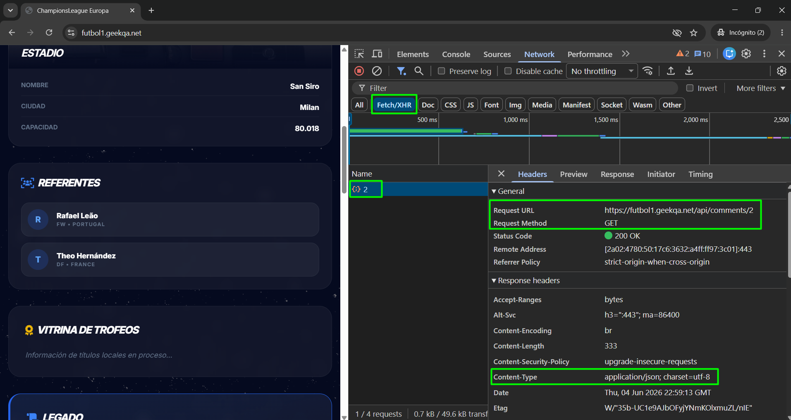
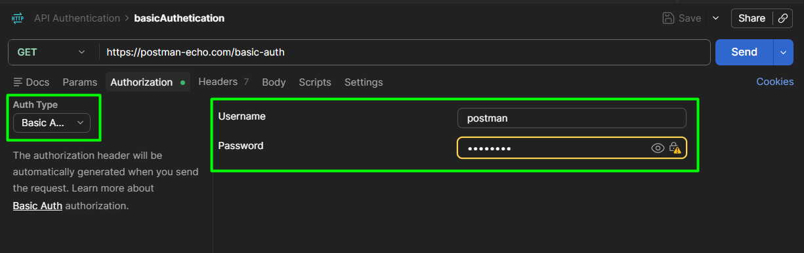
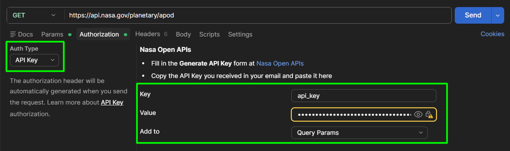
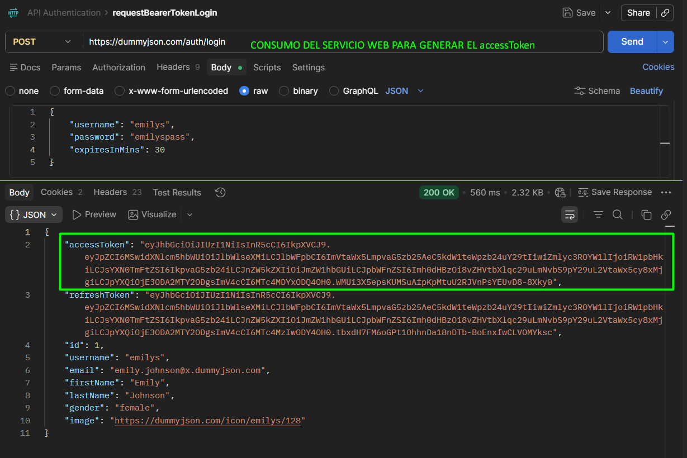
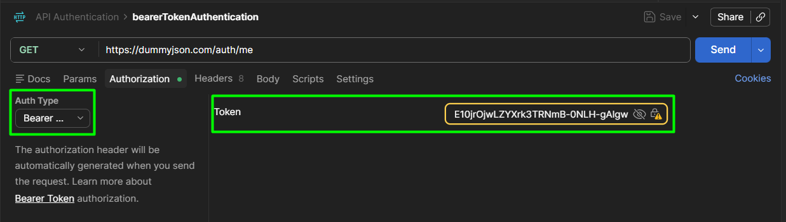

<h1 align="center">
CONOCIMIENTOS APRENDIDOS RELACIONADOS AL CONSUMO DE API
</h1>

## 🔹 API'S DE PRUEBAS PARA PRÁCTICAS

- https://petstore.swagger.io/
- https://buggy.justtestit.org/
- https://futbol1.geekqa.net
- https://student.geekqa.net/api/students/ (REQUIERE BearerToken | **email:** geekqa@test.com **password:** geekqa2025)

## 🔹 OPCIONES DE CONSOLA DEL NAVEGADOR

Para observar el llamado a las APIS desde el navegador de preferencia , y realizamos los siguientes pasos:
1. En el navegador hacemos click derecho, y seleccionamos la herramienta de Inspeccionar.
2. Dentro de la herramienta Inspeccionar, seleccionamos la opción Network.
3. En la sección de Network, marcamos la opción Fetch/XHR, y cada vez que vayamos realizando acciones en el navehador, aquí se mostrará el llamado que se realiza a las diferentes API's.

  

  

## 🔹 MÉTODOS DE AUTENTICACIÓN MAS UTILIZADOS

- ### Autenticación Básica: (Basic Auth) ###
Solicita el username y el password para consumir el Servicio de Autenticación.

  

 

- ### API Key: ### 
Se tiene que generar la API Key en la página dueña del API, para poder hacer el consumo del Servicio de autenticación.

  

 

- ### Bearer Token: ###
Primero se realiza el consumo de un servicio en método POST, con los datos de username y password, y en la respuesta del servicio se genera un accessToken, el cual se debe asignar en la autenticación de los servicios privados.

  
  

 
