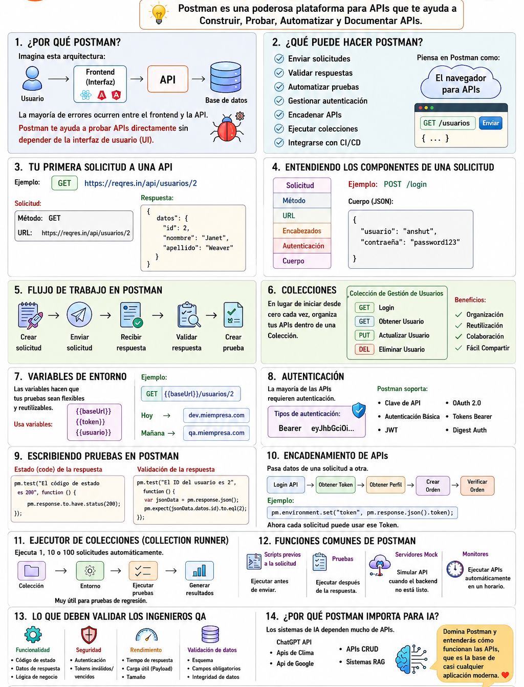

<h1 align="center">
PASO A PASO BÁSICO PARA LA AUTOMATIZACIÓN DE UN PROYECTO, UTILIZANDO SELENIUM + JAVA + MAVEN + CUCUMBER(BDD) + SERENITY
</h1>

##  ESTRUCTURA BASE DEL PROYECTO, UTILIZANDO POM (PAGE OBJECT MODEL)

```text
ProyectoPrincipal/
├── pom.xml
├── serenity.properties
├── src/
│   ├── main/java/pe/tpidoweb/
│   │   ├── driver/
│   │   │   └── TPidoWebDriver.java        → Fábrica de WebDriver (Chrome/Firefox/Edge)
│   │   ├── menu/
│   │   │   └── MenuPrincipal.java         → Page Object del menú de navegación
│   │   └── pagina/
│   │       ├── base/
│   │       │   └── PaginaBase.java        → Clase padre de todos los Page Objects
│   │       ├── login/
│   │       │   ├── PaginaLogin.java
│   │       │   └── PaginaRegistro.java
│   │       └── pedido/
│   │           └── PaginaRegistrarPedido.java
│   └── test/
│       ├── java/pe/tpidoweb/
│       │   ├── clientes/insertar/
│       │   │   ├── RegistrarClientesStep.java   → Step Definitions
│       │   │   └── RegistrarClientesTest.java   → Runner (JUnit 5 Suite)
│       │   ├── pedidos/insertar/
│       │   │   ├── RegistrarPedidosStep.java
│       │   │   └── RegistrarPedidosTest.java
│       │   └── suite/
│       │       └── SuiteProductosTest.java      → Suite que agrupa ambos runners
│       └── resources/features/
│           ├── usuarios/insertar-usuarios.feature
│           └── pedidos/crear-pedido.feature 
```
## REGLA DE MAVEN:
- Todo lo que va en src/main/java es código de producción/librería (los Page Objects, en este caso, porque son reutilizables). 
- Todo lo que va en src/test/java es código de prueba (features, steps, runners).

<p align="center">
  
</p> 


## 📌 API'S DE PRUEBAS PARA PRÁCTICAS

- https://petstore.swagger.io/


## 🎓 SOCIALIZACIÓN DEL POR QUÉ USAR POSTMAN
<p align="center">
  
</p> 

## 🔹 OPCIONES DE CONSOLA DEL NAVEGADOR
