<h1 align="center">
PASO A PASO BÁSICO PARA LA AUTOMATIZACIÓN DE UN PROYECTO, UTILIZANDO SELENIUM + JAVA + MAVEN + CUCUMBER(BDD) + SERENITY
</h1>

##  ESTRUCTURA BASE DEL PROYECTO, UTILIZANDO POM (PAGE OBJECT MODEL)

```text
ProyectoPrincipal/
├── pom.xml
├── serenity.properties
├── src/
│   ├── main/java/pe/tpidoweb/
│   │   ├── driver/
│   │   │   └── TPidoWebDriver.java        → Fábrica de WebDriver (Chrome/Firefox/Edge)
│   │   ├── menu/
│   │   │   └── MenuPrincipal.java         → Page Object del menú de navegación
│   │   └── pagina/
│   │       ├── base/
│   │       │   └── PaginaBase.java        → Clase padre de todos los Page Objects
│   │       ├── login/
│   │       │   ├── PaginaLogin.java
│   │       │   └── PaginaRegistro.java
│   │       └── pedido/
│   │           └── PaginaRegistrarPedido.java
│   └── test/
│       ├── java/pe/tpidoweb/
│       │   ├── clientes/insertar/
│       │   │   ├── RegistrarClientesStep.java   → Step Definitions
│       │   │   └── RegistrarClientesTest.java   → Runner (JUnit 5 Suite)
│       │   ├── pedidos/insertar/
│       │   │   ├── RegistrarPedidosStep.java
│       │   │   └── RegistrarPedidosTest.java
│       │   └── suite/
│       │       └── SuiteProductosTest.java      → Suite que agrupa ambos runners
│       └── resources/features/
│           ├── usuarios/insertar-usuarios.feature
│           └── pedidos/crear-pedido.feature 
```
## REGLA DE MAVEN:
- Todo lo que va en src/main/java es código de producción/librería (los Page Objects, en este caso, porque son reutilizables). 
- Todo lo que va en src/test/java es código de prueba (features, steps, runners).

<p align="center">
  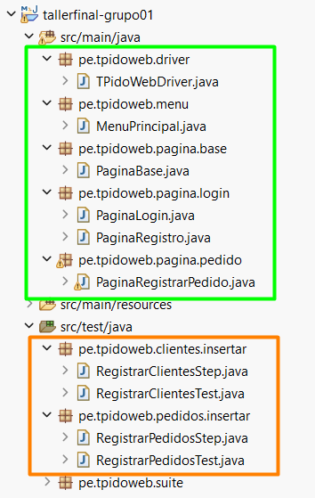
</p> 


## 📌 ORDEN DE CREACIÓN EL PROYECTO DESDE 0

### Página de pruebas a utilizar
https://cmc86jstaling.pythonanywhere.com/

1. Lo primero que debemos realizar es crear un nuevo proyecto tipo MAVEN en el Ide de Eclipse.

<p align="center">
  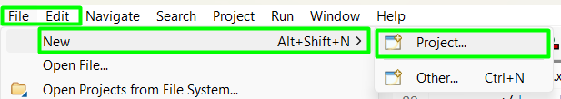
</p>
<p align="center">
  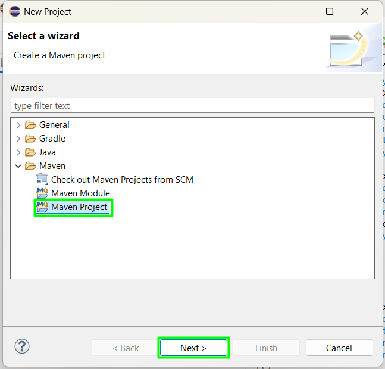
</p>
<p align="center">
  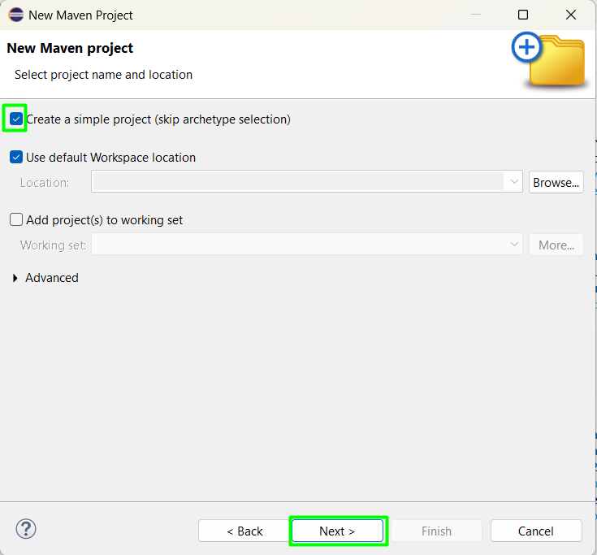
</p>
<p align="center">
  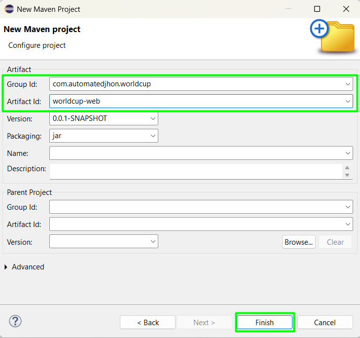
</p>
<p align="center">
  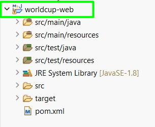
</p>

2. Se procederá a realizar la configuración el archivo pom.xml, en el cual se configurarán las Propiedades, Dependencias y Builds que necesitemos utilizar en nuestro proyecto (Selenium, JUnit, Cucumber, Serenity, etc).

<p align="center">
  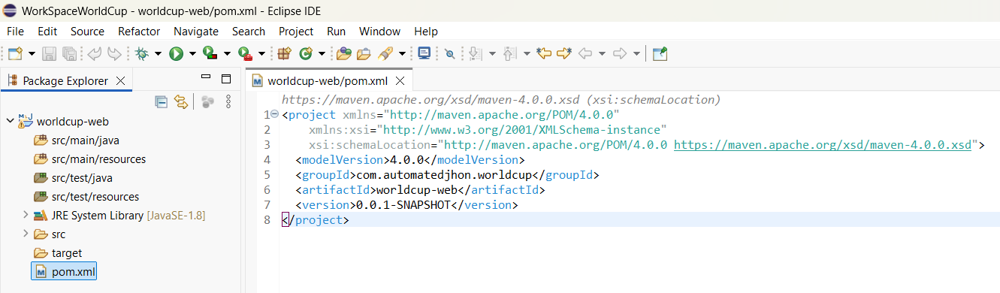
</p>

### Principales Propiedades a utilizar
<p align="center">
  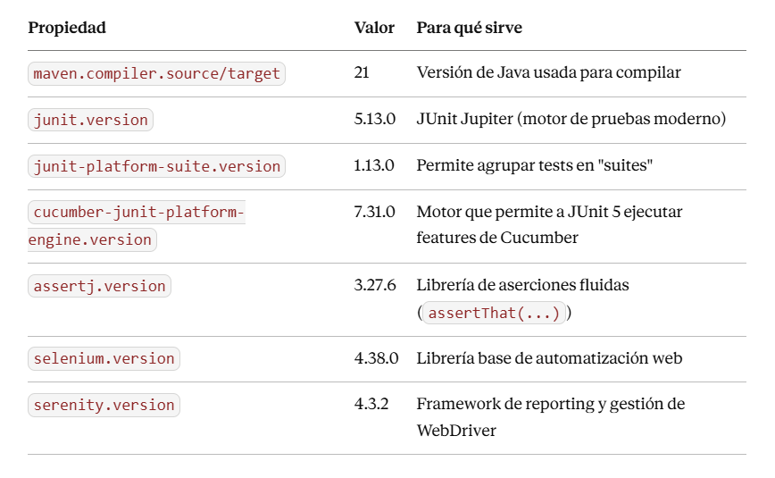
</p>

<p align="center">
  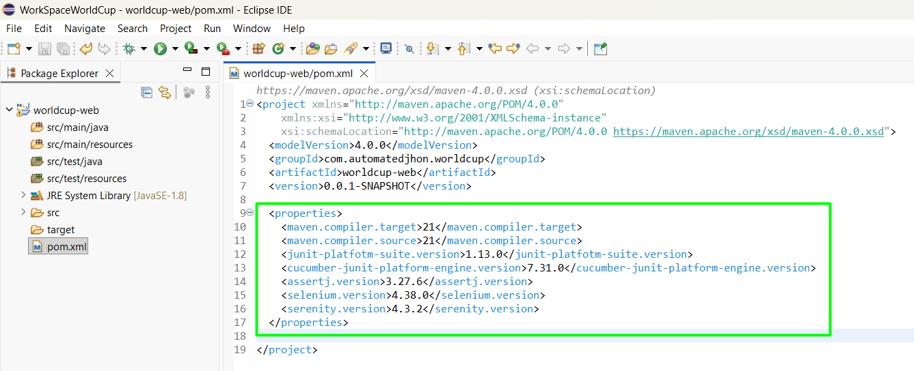
</p>

### Principales Dependencias a utilizar
Las dependencias que necesitemos utilizar en nuestro proyecto, la podemos descargar desde: https://mvnrepository.com/

<p align="center">
  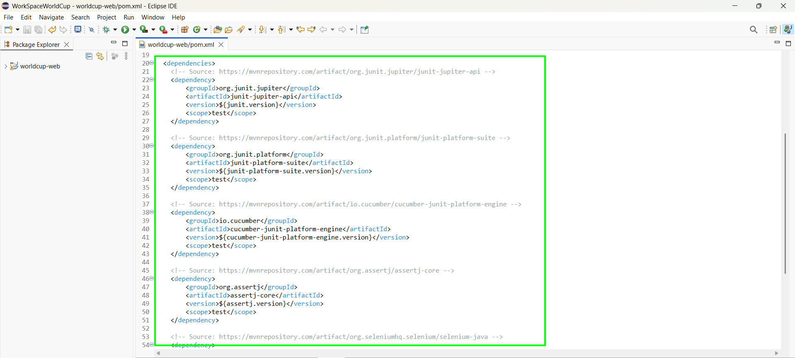
</p>

### Principales Builds a utilizar
Las builds que necesitemos configurar en nuestro proyecto, para el tema de ejecución de los Test y el proceso de Reportes.
<p align="center">
  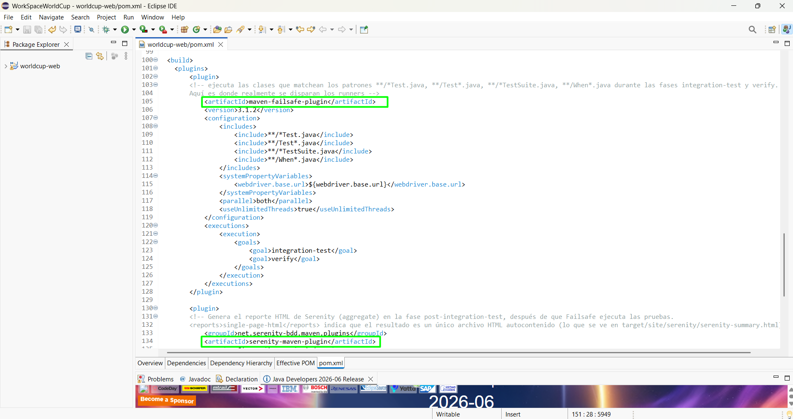
</p>

Principalmente se usarán 2 builds en el proyecto base.
- maven-failsafe-plugin: Ejecuta las clases que matchean los patrones **/*Test.java, **/Test*.java, **/*TestSuite.java, **/When*.java durante las fases integration-test y verify. Aquí es donde realmente se disparan los runners.

- serenity-maven-plugin: genera el reporte HTML de Serenity (aggregate) en la fase post-integration-test, después de que Failsafe ejecuta las pruebas.

### Archivo pom.xml completo
```xml
<project xmlns="http://maven.apache.org/POM/4.0.0" 
	xmlns:xsi="http://www.w3.org/2001/XMLSchema-instance" 
	xsi:schemaLocation="http://maven.apache.org/POM/4.0.0 https://maven.apache.org/xsd/maven-4.0.0.xsd">
  <modelVersion>4.0.0</modelVersion>
  <groupId>com.automatedjhon.worldcup</groupId>
  <artifactId>worldcup-web</artifactId>
  <version>0.0.1-SNAPSHOT</version>
  
  <properties>
  	<maven.compiler.target>21</maven.compiler.target>
  	<maven.compiler.source>21</maven.compiler.source>
  	<junit.version>6.1.0</junit.version>
  	<junit-platform-suite.version>6.1.1</junit-platform-suite.version>
  	<cucumber-junit-platform-engine.version>7.34.4</cucumber-junit-platform-engine.version>
  	<assertj.version>3.27.7</assertj.version>
  	<selenium.version>4.45.0</selenium.version>
  	<serenity.version>5.3.11</serenity.version>	
  </properties>
  
  <dependencies>
  	<!-- Source: https://mvnrepository.com/artifact/org.junit.jupiter/junit-jupiter-api -->
	<dependency>
    	<groupId>org.junit.jupiter</groupId>
    	<artifactId>junit-jupiter-api</artifactId>
    	<version>${junit.version}</version>
    	<scope>test</scope>
	</dependency>
	
	<!-- Source: https://mvnrepository.com/artifact/org.junit.platform/junit-platform-suite -->
	<dependency>
    	<groupId>org.junit.platform</groupId>
    	<artifactId>junit-platform-suite</artifactId>
    	<version>${junit-platform-suite.version}</version>
    	<scope>test</scope>
	</dependency>
	
	<!-- Source: https://mvnrepository.com/artifact/io.cucumber/cucumber-junit-platform-engine -->
	<dependency>
    	<groupId>io.cucumber</groupId>
    	<artifactId>cucumber-junit-platform-engine</artifactId>
    	<version>${cucumber-junit-platform-engine.version}</version>
    	<scope>test</scope>
	</dependency>
	
	<!-- Source: https://mvnrepository.com/artifact/org.assertj/assertj-core -->
	<dependency>
    	<groupId>org.assertj</groupId>
    	<artifactId>assertj-core</artifactId>
    	<version>${assertj.version}</version>
    	<scope>test</scope>
	</dependency>
	
	<!-- Source: https://mvnrepository.com/artifact/org.seleniumhq.selenium/selenium-java -->
	<dependency>
    	<groupId>org.seleniumhq.selenium</groupId>
    	<artifactId>selenium-java</artifactId>
    	<version>${selenium.version}</version>
    	<scope>compile</scope>
	</dependency>
	
	<!-- Source: https://mvnrepository.com/artifact/net.serenity-bdd/serenity-core -->
	<dependency>
    	<groupId>net.serenity-bdd</groupId>
    	<artifactId>serenity-core</artifactId>
    	<version>${serenity.version}</version>
    	<scope>compile</scope>
	</dependency>
	
	
	<!-- DEPENDENCIAS ADICIONALES QUE FUNCIONAN CON LAS DEPENDENCIAS PRINCIPALES YA CONFIGURADAS -->
	
	<!-- Source: https://mvnrepository.com/artifact/org.slf4j/slf4j-simple -->
	<!-- implementación simple de logging, requerida porque varias librerías (Selenium, Serenity) usan la fachada SLF4J para loguear internamente. -->
	<dependency>
    	<groupId>org.slf4j</groupId>
    	<artifactId>slf4j-simple</artifactId>
    	<version>2.0.17</version>
    	<scope>test</scope>
	</dependency>
	
	<!-- Source: https://mvnrepository.com/artifact/net.serenity-bdd/serenity-cucumber -->
	<!-- el puente entre Serenity y Cucumber. Es lo que permite usar SerenityReporter como plugin de Cucumber (Se verá referenciado en las clases *Test.java) -->
	<dependency>
    	<groupId>net.serenity-bdd</groupId>
    	<artifactId>serenity-cucumber</artifactId>
    	<version>${serenity.version}</version>
    	<scope>compile</scope>
	</dependency>
	
	<!-- Source: https://mvnrepository.com/artifact/org.junit.jupiter/junit-jupiter-engine -->
	<!-- Motor de ejecución de JUnit 5 (No se usa para escribir @Test directamente en el proyecto, ess requerido como base para que las suites funcionen). -->
	<dependency>
    	<groupId>org.junit.jupiter</groupId>
    	<artifactId>junit-jupiter-engine</artifactId>
    	<version>${junit.version}</version>
    	<scope>test</scope>
	</dependency>
  </dependencies>
  
  <build>
  	<plugins>
  		<plugin>
  		<!-- ejecuta las clases que matchean los patrones **/*Test.java, **/Test*.java, **/*TestSuite.java, **/When*.java durante las fases integration-test y verify. 
  		Aquí es donde realmente se disparan los runners -->
			<artifactId>maven-failsafe-plugin</artifactId>
			<version>3.1.2</version>
			<configuration>
				<includes>
					<include>**/*Test.java</include>
					<include>**/Test*.java</include>
					<include>**/*TestSuite.java</include>
					<include>**/When*.java</include>
				</includes>
				<systemPropertyVariables>
					<webdriver.base.url>${webdriver.base.url}</webdriver.base.url>
				</systemPropertyVariables>
				<parallel>both</parallel>
				<useUnlimitedThreads>true</useUnlimitedThreads>
			</configuration>
			<executions>
				<execution>
					<goals>
						<goal>integration-test</goal>
						<goal>verify</goal>
					</goals>
				</execution>
			</executions>
		</plugin>
		
		<plugin>
		<!-- Genera el reporte HTML de Serenity (aggregate) en la fase post-integration-test, después de que Failsafe ejecuta las pruebas. 
		<reports>single-page-html</reports> indica que el resultado es un único archivo HTML autocontenido (lo que se ve en target/site/serenity/serenity-summary.html). -->
			<groupId>net.serenity-bdd.maven.plugins</groupId>
			<artifactId>serenity-maven-plugin</artifactId>
			<version>${serenity.version}</version>
			<configuration>
				<tags>${tags}</tags>
				<reports>single-page-html</reports>
			</configuration>
			<dependencies>
				<dependency>
					<groupId>net.serenity-bdd</groupId>
					<artifactId>serenity-single-page-report</artifactId>
					<version>${serenity.version}</version>
				</dependency>
			</dependencies>
			<executions>
				<execution>
					<id>serenity-reports</id>
					<phase>post-integration-test</phase>
					<goals>
						<goal>aggregate</goal>
					</goals>
				</execution>
			</executions>
		</plugin>	
  	</plugins>
  </build>
</project>
```
3. Se crea y se realiza la configuración del archivo serenity.properties (Donde se define el navegador por defecto y la política de capturas de pantalla (una antes y otra después de cada step de Cucumber — esto es lo que llena los reportes de evidencia visual)).
<p align="center">
  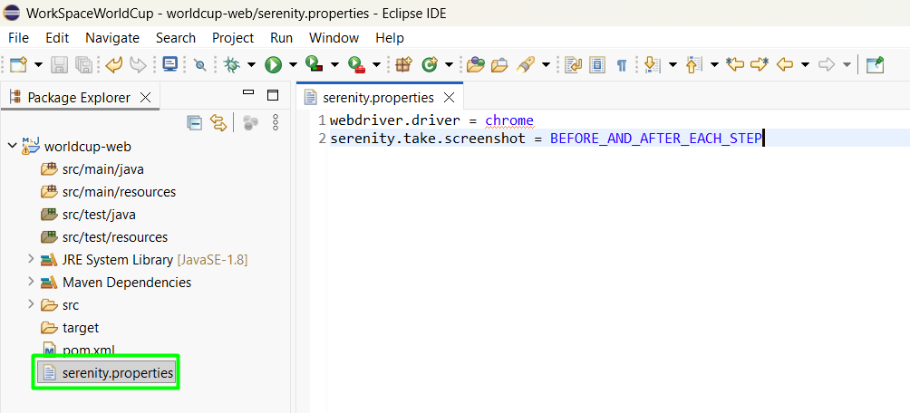
</p>

### Archivo serenity.properties completo
```properties
webdriver.driver = chrome
serenity.take.screenshot = BEFORE_AND_AFTER_EACH_STEP
```

4. El siguiente paso es crear es crear la clase de la Capa del driver (WebDriver), donde se implementa como una constante estática (enum) los navegadores soportados, aplicando configuración común del navegadir (maximizar ventana, timeout implícito, etc) sin duplicar código.

Para ello creamos un paquete en el directorio src/main/java, paquete en el cual crearemos la clase de la capa del driver.
<p align="center">
  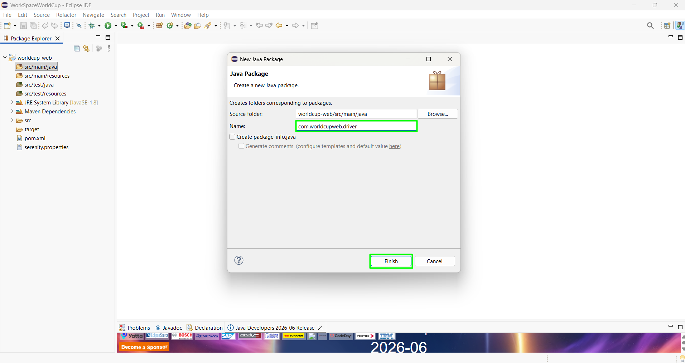
</p>
<p align="center">
  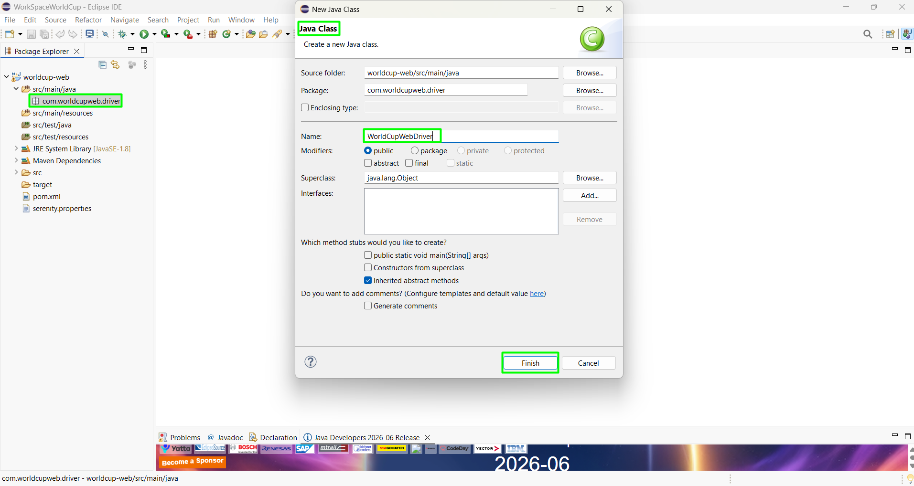
</p>
<p align="center">
  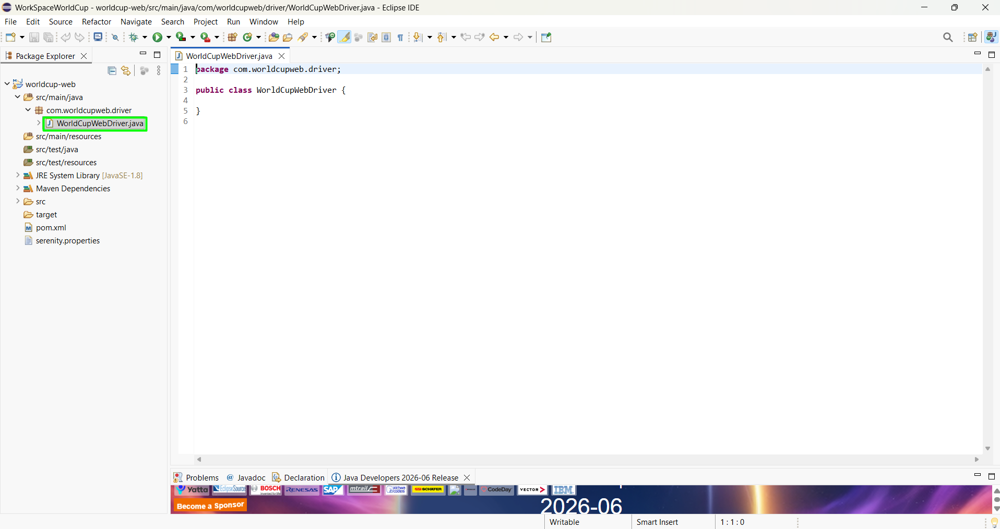
</p>

Como se indicó anteriormente, en esta clase definimos la constante la cual especificará los navegadores que vamos a utilizar.
```java
//Creamos la constante para los navegadores que vamos a utilizar
public enum Navegador { CHROME, FIREFOX, EDGE }
```
También creamos el constructor de la clase, sin ningún contenido dentro de el.
```java
//Se crea el constructor de la clase vacío
public WorldCupWebDriver() {		
}
```
Después creamos un método estático tipo WebDriver, donde se especificará las propiedades que deseamos que tenga el navegador, cómo por ejemplo que se maximize, que se realice algún tipo de espera cuando se estén cargando sus componentes.
```java
//Método estático, para aplicar las configuraciones al navegador.
private static WebDriver aplicarConfiguracionComun(WebDriver driver) {
	driver.manage().window().maximize();
	driver.manage().timeouts().implicitlyWait(Duration.ofSeconds(30));
	return driver;
}
```
La linea driver.manage().timeouts().implicitlyWait(Duration.ofSeconds(30)), Es una espera Implicita, es decir, cuando se busque un elemento y no lo encuentre inmediatamente, espera e inténtalo durante un máximo de 30 segundos antes de darlo por no encontrado. Si lo encuentra a los 3 segundos, ya no seguirá realizando la espera.

El siguiente paso es aplicar la configuración común a cada uno de los navegadores configurados.
```java
//Se aplica la configuración común a cada uno de los navegadores configurados
private static WebDriver getFirefoxDriver() {
	return aplicarConfiguracionComun(new FirefoxDriver());
}
		
private static WebDriver getChromeDriver() {
	return aplicarConfiguracionComun(new ChromeDriver());
}
		
private static WebDriver getEdgeDriver() {
	return aplicarConfiguracionComun(new EdgeDriver());
}
```

Por último en la clase, obtenemos el driver según el navegador que vamos a utilizar
```java
//Obtenemos el Driver según el navegador
public static WebDriver getDriver(Navegador navegador) {
	if(navegador == Navegador.FIREFOX) {
		return getFirefoxDriver();
	}else if(navegador == Navegador.EDGE) {
		return getEdgeDriver();
	}
	return getChromeDriver();
}
```
### Archivo WorldCupWebDriver.java completo
```java
package com.worldcupweb.driver;

import java.time.Duration;

import org.openqa.selenium.WebDriver;
import org.openqa.selenium.chrome.ChromeDriver;
import org.openqa.selenium.edge.EdgeDriver;
import org.openqa.selenium.firefox.FirefoxDriver;

public class WorldCupWebDriver {
	
	//Creamos la constante para los navegadores que vamos a utilizar
	public enum Navegador { CHROME, FIREFOX, EDGE }
	
	//Se crea el constructor de la clase vacío
	public WorldCupWebDriver() {		
	}
	
	//Método estático, para aplicar las configuraciones al navegador.
	private static WebDriver aplicarConfiguracionComun(WebDriver driver) {
		driver.manage().window().maximize();
		driver.manage().timeouts().implicitlyWait(Duration.ofSeconds(30));
		return driver;
	}
	
	//Se aplica la configuración común a cada uno de los navegadores configurados
	private static WebDriver getFirefoxDriver() {
		return aplicarConfiguracionComun(new FirefoxDriver());
	}
			
	private static WebDriver getChromeDriver() {
		return aplicarConfiguracionComun(new ChromeDriver());
	}
			
	private static WebDriver getEdgeDriver() {
		return aplicarConfiguracionComun(new EdgeDriver());
	}
	
	//Obtenemos el Driver según el navegador
	public static WebDriver getDriver(Navegador navegador) {
		if(navegador == Navegador.FIREFOX) {
			return getFirefoxDriver();
		}else if(navegador == Navegador.EDGE) {
			return getEdgeDriver();
		}
		return getChromeDriver();
	}
}
```
