<h1 align="center">
PASO A PASO BÁSICO PARA LA AUTOMATIZACIÓN DE UN PROYECTO, UTILIZANDO SELENIUM + JAVA + MAVEN + CUCUMBER(BDD) + SERENITY
</h1>

##  ESTRUCTURA BASE DEL PROYECTO, UTILIZANDO POM (PAGE OBJECT MODEL)

```text
ProyectoPrincipal/
├── pom.xml
├── serenity.properties
├── src/
│   ├── main/java/pe/tpidoweb/
│   │   ├── driver/
│   │   │   └── TPidoWebDriver.java        → Fábrica de WebDriver (Chrome/Firefox/Edge)
│   │   ├── menu/
│   │   │   └── MenuPrincipal.java         → Page Object del menú de navegación
│   │   └── pagina/
│   │       ├── base/
│   │       │   └── PaginaBase.java        → Clase padre de todos los Page Objects
│   │       ├── login/
│   │       │   ├── PaginaLogin.java
│   │       │   └── PaginaRegistro.java
│   │       └── pedido/
│   │           └── PaginaRegistrarPedido.java
│   └── test/
│       ├── java/pe/tpidoweb/
│       │   ├── clientes/insertar/
│       │   │   ├── RegistrarClientesStep.java   → Step Definitions
│       │   │   └── RegistrarClientesTest.java   → Runner (JUnit 5 Suite)
│       │   ├── pedidos/insertar/
│       │   │   ├── RegistrarPedidosStep.java
│       │   │   └── RegistrarPedidosTest.java
│       │   └── suite/
│       │       └── SuiteProductosTest.java      → Suite que agrupa ambos runners
│       └── resources/features/
│           ├── usuarios/insertar-usuarios.feature
│           └── pedidos/crear-pedido.feature 
```
## REGLA DE MAVEN:
- Todo lo que va en src/main/java es código de producción/librería (los Page Objects, en este caso, porque son reutilizables). 
- Todo lo que va en src/test/java es código de prueba (features, steps, runners).

<p align="center">
  
</p> 


## 📌 ORDEN DE CREACIÓN EL PROYECTO DESDE 0

### Página de pruebas a utilizar
https://cmc86jstaling.pythonanywhere.com/

1. Lo primero que debemos realizar es crear un nuevo proyecto tipo MAVEN en el Ide de Eclipse.

<p align="center">
  
</p>
<p align="center">
  
</p>
<p align="center">
  
</p>
<p align="center">
  
</p>
<p align="center">
  
</p>

2. Se procederá a realizar la configuración el archivo pom.xml, en el cual se configurarán las Propiedades, Dependencias y Builds que necesitemos utilizar en nuestro proyecto (Selenium, JUnit, Cucumber, Serenity, etc).

<p align="center">
  
</p>

### Principales Propiedades a utilizar
<p align="center">
  
</p>

<p align="center">
  
</p>

### Principales Dependencias a utilizar
Las dependencias que necesitemos utilizar en nuestro proyecto, la podemos descargar desde: https://mvnrepository.com/

<p align="center">
  
</p>

### Principales Builds a utilizar
Las builds que necesitemos configurar en nuestro proyecto, para el tema de ejecución de los Test y el proceso de Reportes.
<p align="center">
  
</p>

Principalmente se usarán 2 builds en el proyecto base.
- maven-failsafe-plugin: Ejecuta las clases que matchean los patrones **/*Test.java, **/Test*.java, **/*TestSuite.java, **/When*.java durante las fases integration-test y verify. Aquí es donde realmente se disparan los runners.

- serenity-maven-plugin: genera el reporte HTML de Serenity (aggregate) en la fase post-integration-test, después de que Failsafe ejecuta las pruebas.

### Archivo pom.xml completo
```xml
<project xmlns="http://maven.apache.org/POM/4.0.0" 
	xmlns:xsi="http://www.w3.org/2001/XMLSchema-instance" 
	xsi:schemaLocation="http://maven.apache.org/POM/4.0.0 https://maven.apache.org/xsd/maven-4.0.0.xsd">
  <modelVersion>4.0.0</modelVersion>
  <groupId>com.automatedjhon.worldcup</groupId>
  <artifactId>worldcup-web</artifactId>
  <version>0.0.1-SNAPSHOT</version>
  
  <properties>
  	<maven.compiler.target>21</maven.compiler.target>
  	<maven.compiler.source>21</maven.compiler.source>
  	<junit.version>6.1.1</junit.version>
  	<cucumber-junit-platform-engine.version>7.34.4</cucumber-junit-platform-engine.version>
  	<assertj.version>3.27.7</assertj.version>
  	<selenium.version>4.45.0</selenium.version>
  	<serenity.version>5.3.11</serenity.version>	
  </properties>
  
  <!-- El BOM se encargará de seleccionar versiones compatibles entre sí, para evitar conflicto de versiones -->
  <dependencyManagement>
  	<dependencies>
    	<dependency>
        	<groupId>org.junit</groupId>
            <artifactId>junit-bom</artifactId>
            <version>${junit.version}</version>
            <type>pom</type>
            <scope>import</scope>
        </dependency>
    </dependencies>
  </dependencyManagement>
  
  <dependencies>
  	<!-- Source: https://mvnrepository.com/artifact/org.junit.jupiter/junit-jupiter-api -->
	<dependency>
    	<groupId>org.junit.jupiter</groupId>
    	<artifactId>junit-jupiter-api</artifactId>
    	<scope>test</scope>
	</dependency>
	
	<!-- Source: https://mvnrepository.com/artifact/org.junit.platform/junit-platform-suite -->
	<dependency>
    	<groupId>org.junit.platform</groupId>
    	<artifactId>junit-platform-suite</artifactId>
    	<scope>test</scope>
	</dependency>
	
	<!-- Source: https://mvnrepository.com/artifact/io.cucumber/cucumber-junit-platform-engine -->
	<dependency>
    	<groupId>io.cucumber</groupId>
    	<artifactId>cucumber-junit-platform-engine</artifactId>
    	<version>${cucumber-junit-platform-engine.version}</version>
    	<scope>test</scope>
	</dependency>
	
	<!-- Source: https://mvnrepository.com/artifact/org.assertj/assertj-core -->
	<dependency>
    	<groupId>org.assertj</groupId>
    	<artifactId>assertj-core</artifactId>
    	<version>${assertj.version}</version>
    	<scope>test</scope>
	</dependency>
	
	<!-- Source: https://mvnrepository.com/artifact/org.seleniumhq.selenium/selenium-java -->
	<dependency>
    	<groupId>org.seleniumhq.selenium</groupId>
    	<artifactId>selenium-java</artifactId>
    	<version>${selenium.version}</version>
    	<scope>compile</scope>
	</dependency>
	
	<!-- Source: https://mvnrepository.com/artifact/net.serenity-bdd/serenity-core -->
	<dependency>
    	<groupId>net.serenity-bdd</groupId>
    	<artifactId>serenity-core</artifactId>
    	<version>${serenity.version}</version>
    	<scope>compile</scope>
	</dependency>
	
	
	<!-- DEPENDENCIAS ADICIONALES QUE FUNCIONAN CON LAS DEPENDENCIAS PRINCIPALES YA CONFIGURADAS -->
	
	<!-- Source: https://mvnrepository.com/artifact/org.slf4j/slf4j-simple -->
	<!-- implementación simple de logging, requerida porque varias librerías (Selenium, Serenity) usan la fachada SLF4J para loguear internamente. -->
	<dependency>
    	<groupId>org.slf4j</groupId>
    	<artifactId>slf4j-simple</artifactId>
    	<version>2.0.17</version>
    	<scope>test</scope>
	</dependency>
	
	<!-- Source: https://mvnrepository.com/artifact/net.serenity-bdd/serenity-cucumber -->
	<!-- el puente entre Serenity y Cucumber. Es lo que permite usar SerenityReporter como plugin de Cucumber (Se verá referenciado en las clases *Test.java) -->
	<dependency>
    	<groupId>net.serenity-bdd</groupId>
    	<artifactId>serenity-cucumber</artifactId>
    	<version>${serenity.version}</version>
    	<scope>compile</scope>
	</dependency>
	
	<!-- Source: https://mvnrepository.com/artifact/org.junit.jupiter/junit-jupiter-engine -->
	<!-- Motor de ejecución de JUnit 5 (No se usa para escribir @Test directamente en el proyecto, ess requerido como base para que las suites funcionen). -->
	<dependency>
    	<groupId>org.junit.jupiter</groupId>
    	<artifactId>junit-jupiter-engine</artifactId>
    	<scope>test</scope>
	</dependency>
  </dependencies>
  
  <build>
  	<plugins>
  		<plugin>
  		<!-- ejecuta las clases que matchean los patrones **/*Test.java, **/Test*.java, **/*TestSuite.java, **/When*.java durante las fases integration-test y verify. 
  		Aquí es donde realmente se disparan los runners -->
			<artifactId>maven-failsafe-plugin</artifactId>
			<version>3.1.2</version>
			<configuration>
				<includes>
					<include>**/*Test.java</include>
					<include>**/Test*.java</include>
					<include>**/*TestSuite.java</include>
					<include>**/When*.java</include>
				</includes>
				<systemPropertyVariables>
					<webdriver.base.url>${webdriver.base.url}</webdriver.base.url>
				</systemPropertyVariables>
				<parallel>both</parallel>
				<useUnlimitedThreads>true</useUnlimitedThreads>
			</configuration>
			<executions>
				<execution>
					<goals>
						<goal>integration-test</goal>
						<goal>verify</goal>
					</goals>
				</execution>
			</executions>
		</plugin>
		
		<!-- Excluye la ejecución surefire, para que no se ejecute doble vez cada vez que ejecute el maven verify -->
		<plugin>
    		<groupId>org.apache.maven.plugins</groupId>
    			<artifactId>maven-surefire-plugin</artifactId>
    				<version>3.2.5</version>
    					<configuration>
        					<excludes>
            					<exclude>**/*Test.java</exclude>
            					<exclude>**/Test*.java</exclude>
            					<exclude>**/*TestSuite.java</exclude>
        					</excludes>
    					</configuration>
		</plugin>
		
		<plugin>
		<!-- Genera el reporte HTML de Serenity (aggregate) en la fase post-integration-test, después de que Failsafe ejecuta las pruebas. 
		<reports>single-page-html</reports> indica que el resultado es un único archivo HTML autocontenido (lo que se ve en target/site/serenity/serenity-summary.html). -->
			<groupId>net.serenity-bdd.maven.plugins</groupId>
			<artifactId>serenity-maven-plugin</artifactId>
			<version>${serenity.version}</version>
			<configuration>
				<tags>${tags}</tags>
				<reports>single-page-html</reports>
			</configuration>
			<dependencies>
				<dependency>
					<groupId>net.serenity-bdd</groupId>
					<artifactId>serenity-single-page-report</artifactId>
					<version>${serenity.version}</version>
				</dependency>
			</dependencies>
			<executions>
				<execution>
					<id>serenity-reports</id>
					<phase>post-integration-test</phase>
					<goals>
						<goal>aggregate</goal>
					</goals>
				</execution>
			</executions>
		</plugin>	
  	</plugins>
  </build>
</project>
```
3. Se crea y se realiza la configuración del archivo serenity.conf en la ruta src/test/resources, donde se define la URL de la página a navegar, el tiempo de las pausas implicitas para los componentes, el nombre del proyecto para visualizarlo en los reportes y la política de capturas de pantalla (una antes y otra después de cada step de Cucumber — esto es lo que llena los reportes de evidencia visual)).
Igualmente se define las propiedades de los diferentes navegadores que deseemos utilizar. 
<p align="center">
  
</p>

### Archivo serenity.conf completo
```properties
webdriver {
    base.url = "https://cmc86jstaling.pythonanywhere.com"
    wait.for.timeout = 10000
}

serenity {
    project.name = "WorldCup Web - Automation Testing"
    take.screenshot = AFTER_EACH_STEP
}

environments {
    chrome {
        webdriver {
            driver = "chrome"
            capabilities {
                browserName = "chrome"
            }
        }
    }

    edge {
        webdriver {
            driver = "edge"
            capabilities {
                browserName = "MicrosoftEdge"
            }
        }
    }

    firefox {
        webdriver {
            driver = "firefox"
            capabilities {
                browserName = "firefox"
            }
        }
    }
}
```

4. El siguiente paso es crear un nuevo paquete com.worldcupweb.paginabase en el directorio src/main/java, donde se creará la clase base para todo el proyecto, debido a que las páginas principales del proyecto heredarán de ella.

Esta clase heredará de PageObject, utilizando las funcionalidades que Serenity proporciona en PageObject. 

El método obtenerBaseUrl() se encargá de obtener la URL base configurada para las pruebas (En el archivo serenity.conf).

El método abrirPagina() se encargá ejecutar el navegador con la URL que obtuvimos en el método obtenerBaseUrl().

### Archivo PaginaBase.java completo
```java
package com.worldcupweb.paginabase;

import org.openqa.selenium.WebDriver;

import net.serenitybdd.core.di.SerenityInfrastructure;
import net.serenitybdd.core.pages.PageObject;
import net.thucydides.model.util.EnvironmentVariables;

public class PaginaBase extends PageObject {
	
	public PaginaBase(WebDriver driver) {
		super(driver);
	}
	
	//Método para cargar la página web
	protected String obtenerBaseUrl() {
		//APIs de configuración de Serenity, para obtener la URL del proyecto del archivo serenity.properties
		EnvironmentVariables environmentVariables = SerenityInfrastructure.getEnvironmentVariables();
        return environmentVariables.getProperty("webdriver.base.url");
    }
	
	//Método de la página base para obtener la página que deseamos ejecutar.
	protected void abrirPagina() {
		getDriver().get(obtenerBaseUrl());
	}
}
```

5. En el siguiente paso se realizará la implementación de paquetes y clases por funcionalidad, en el directorio src/main/java.

Por ejemplo para la funcionalidad de login, se creará un paquete denominado com.worldcupweb.paginalogin, y dentro de el se deberá crear la clase PaginaLogin.java.
<p align="center">
  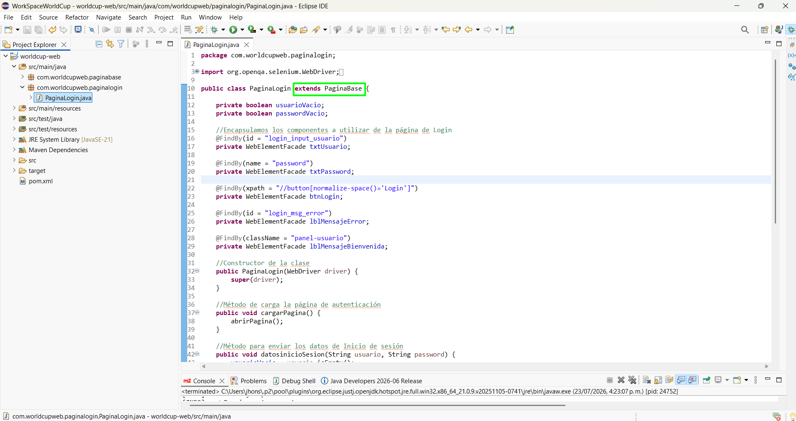
</p>

Estas páginas deberán heredar la implementación que se realizó en la clase PaginaBase.java, mediante la palabra reservada extends
```java
public class PaginaLogin extends PaginaBase
```
También se deberá implementar el constructor de la clase, y su función principal es recibir una instancia del navegador (WebDriver) y pasarla a la clase padre mediante super(driver).
```java
public PaginaLogin(WebDriver driver) {
	super(driver);
}
```
El siguiente paso es Encapsular todos los componentes que vamos a utilizar de la página de Login.
Para ello desde el navegador ejecutamos la opción inspeccionar, y obtendremos los atributos de los componentes (Por lo generar es bueno utilizar los atributos id, name, o armar el xpath para localizar los elementos).
En este caso localizaremos el campo usuario en el navegador.
<p align="center">
  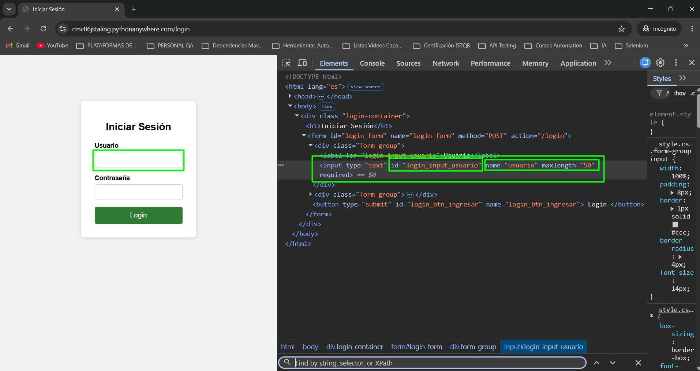
</p>

```java
//Encapsulamos los componentes a utilizar de la página de Login
@FindBy(id = "login_input_usuario")
private WebElement txtUsuario;
	
@FindBy(name = "password")
private WebElement txtPassword;
	
@FindBy(xpath = "//button[text()='Login']")
private WebElement btnLogin;
```
En el siguiente paso crearemos un método en el cual se realizará la carga del sitio web, mediante la opción driver.get("sitioweb").
```java
//Método para cargar la página web
public void cargarPagina()
{
	driver.get("https://cmc86jstaling.pythonanywhere.com");
}
```
De aquí en adelante se implementarán los métodos o acciones necesarias que deseamos implementar en nuestra página de Login. Para nuestro ejemplo implementaremos el método iniciarSesion, el cuan recibirá como parámetro el usuario y el password del funcionario que se desea autenticar en la plataforma.
En este mismo método realizaremos 2 acciones sobre los componentes de la clase.
- Mediante la opción txtUsuario.clear(), limpiaremos el campo de texto por si tiene algún texto escrito (Esto se hace como buena práctica).
- Mediante la opción txtUsuario.sendKeys(usuario), se ingresa en el campo de texto la cadena que deseamos enviar.
- Mediante la opción btnLogin.click(), se hará la acción de click en el botón.

```java
//Método para Iniciar Sesión
public void iniciarSesion(String usuario, String password) {
	txtUsuario.clear();
	txtUsuario.sendKeys(usuario);
		
	txtPassword.clear();
	txtPassword.sendKeys(password);
		
	btnLogin.click();
}
```

### Archivo PaginaLogin.java completo
```java
package com.worldcup.login;

import org.openqa.selenium.WebDriver;
import org.openqa.selenium.WebElement;
import org.openqa.selenium.support.FindBy;

import com.worldcupweb.paginabase.PaginaBase;

public class PaginaLogin extends PaginaBase {
	
	//Encapsulamos los componentes a utilizar de la página de Login
	@FindBy(id = "login_input_usuario")
	private WebElement txtUsuario;
	
	@FindBy(name = "password")
	private WebElement txtPassword;
	
	@FindBy(xpath = "//button[text()='Login']")
	private WebElement btnLogin;
	
	//Constructor de la clase
	public PaginaLogin(WebDriver driver) {
		super(driver);
	}
	
	//Método para cargar la página web
	public void cargarPagina()
	{
		driver.get("https://cmc86jstaling.pythonanywhere.com");
	}
	
	//Método para Iniciar Sesión
	public void iniciarSesion(String usuario, String password) {
		txtUsuario.clear();
		txtUsuario.sendKeys(usuario);
		
		txtPassword.clear();
		txtPassword.sendKeys(password);
		
		btnLogin.click();
	}
}
```

7. En este punto ya podemos empezar a realizar la construccción de nuestros Features en lenguaje Gerkhin.
Para realizar la implementación de los Features, nos debemos ubicar en la ruta src/test/resources, y ahí crearemos una carpeta denominada features.
<p align="center">
  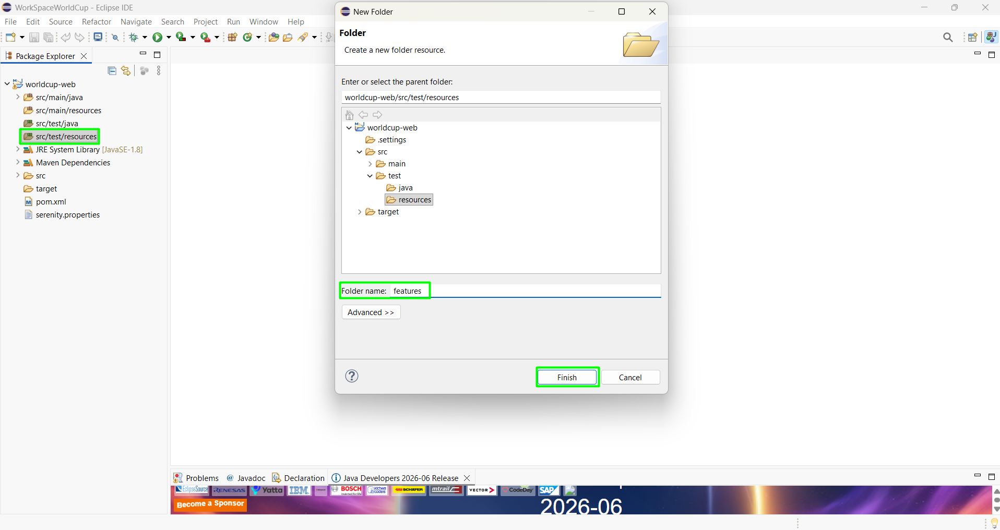
</p>

Dentro de la carpeta features, crearemos las diferentes carpetas dependiendo de los módulos, donde ubicaremos los archivos en formato .feature.
<p align="center">
  
</p>
<p align="center">
  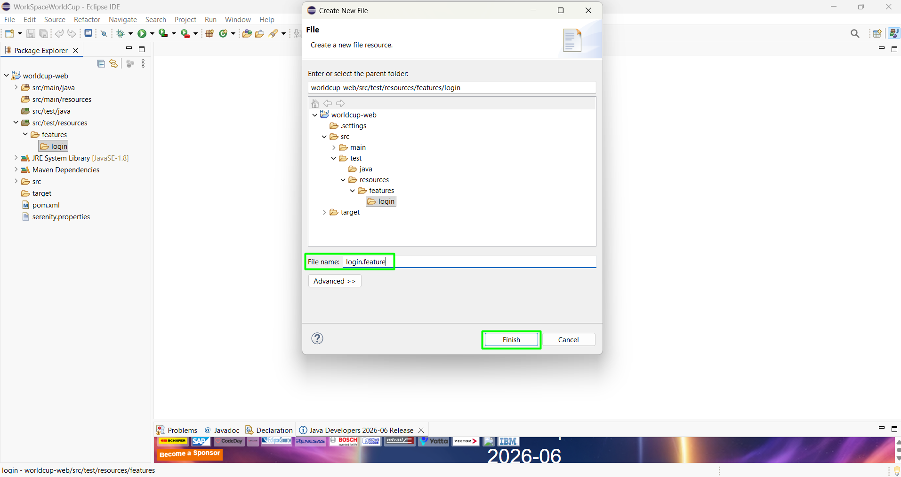
</p>
<p align="center">
  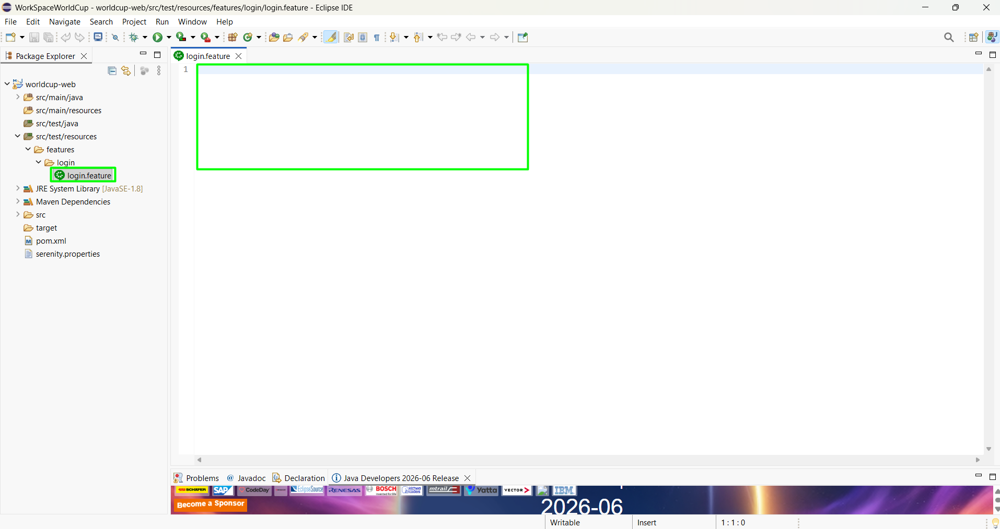
</p>

En el archivo .feature, digitaremos en lenguaje Gerkhin el caso de prueba a validar, utilizando las palabras clave Given, When, Then, And.
Aquí también especificaremos los datos de prueba, junto con los mensajes esperados. Cada ejemplo se consideraría como un Caso de prueba.

### Archivo login.feature completo
```feature
Feature: Gestionar Login
	Scenario Outline: Proceso de autenticación
		Given cargo la página WorldCupWeb
			And Ingreso el usuario de autenticacion <usuario> y el password <password>
		When selecciono el botón login
		Then el sistema debe mostrar el <mensajeEsperado>
	Examples:
	|    usuario    |    password    |               mensajeEsperado             |
	|      ""       |   "admin123"   | 	"Usuario y contraseña son obligatorios." |
	| "j.sevillano" |       ""       | 	"Usuario y contraseña son obligatorios." |
	| "j.sevillano" |   "admin123"   | 	  "Usuario o contraseña incorrectos."    |
	| "j.sevillano" |  "testing123." | 	                  ""                     |
```

8. Una vez definamos la información de nuestros features, el siguiente paso es crear los StepDefinitions (Pasos definidos en el feature), en la siguiente ruta:
src/test/java.
Para ello, crearemos el repectivo paquete dependiendo de la funcionalidad que necesitamos validar.
<p align="center">
  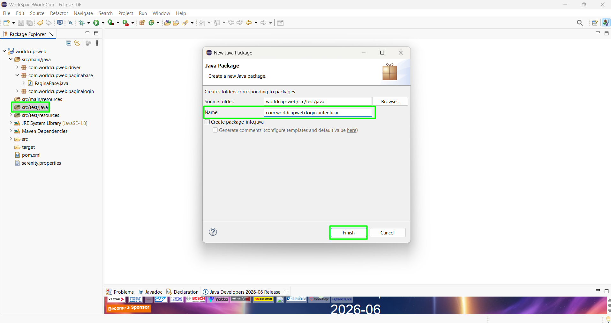
</p>
Después de crear el paquete, se procederá a crear la clase AutenticacionStep.java, en la cual agregaremos la lógica de los pasos que definimos en el archivo login.feature
<p align="center">
  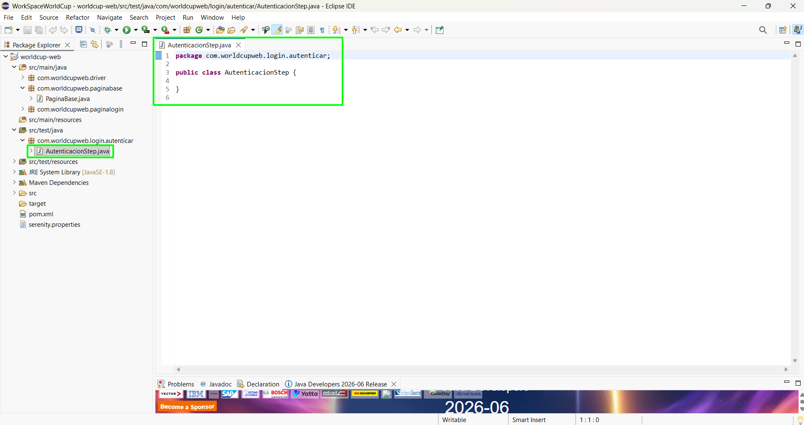
</p>

Los Steps conectan cada línea Gherkin con código Java real. Aquí se instancian los Page Objects (normalmente en un método anotado como @Before) y se destruye el driver al final (@After → driver.quit()). 

La anotación @Managed de Serenity es la que le indica al framework "administra este WebDriver por mí" (inyecta la instancia y la limpia automáticamente si no la cierras manualmente.
```java
//Esta anotación @Managed de Serenity es la que le indica al framework "administra este WebDriver por mí"
@Managed
WebDriver driver;
```

Posteriormente implementaremos la anotación @BeforeEach, en la cual programaremos el método de inicializarNavegador(), el cual debe ejecutarse antes de cada método de prueba @Test (Es decir se ejecutará siempre, antes de cada prueba programada). En nuestro caso le indicamos que inicialice el navegador antes de cada Test que programemos.

```java
@BeforeEach
public void inicializarNavegador() {
	driver = WorldCupWebDriver.getDriver(Navegador.CHROME);
}
```

Así como programamos acciones antes de iniciar cada test con @BeforeEach, también podemos programar acciones después de ejecutar cada test, con la anotación @After.
Aquí crearemos un método cerrarDriver(), el cual nos permitirá que después de cada test cerrar el driver para no saturar la memoria del equipo.
Para hacer el cierre del driver, se deberá implementar la función driver.quit();

```java
//Cerramos el driver después de cada Test
@After
public void cerrarDriver() {
	driver.quit();
}
```

Después de realizar la configuración de las anotaciones, procederemos a implementar los pasos en lenguaje Java, con los pasos que implementamos en el archivo .feature.
Aquí se usarán las mismas anotaciones en lenguaje Gerkhin que utilizamos en el archivo .feature (@Given, @When, @Then, @And etc).

```java
//Aquí se realiza la implementación de la logica Gerkhin en Lenguaje java
@Given("cargo la página WorldCupWeb")
public void cargarPaginaLogin() {
	paginaLogin.cargarPagina();
}
	
@And("Ingreso el usuario de autenticacion {string} y el password {string}")
public void ingresarDatosAutenticacion(String usuario, String password) {
	paginaLogin.datosinicioSesion(usuario, password);
}
	
@When("selecciono el botón login")
public void accionIniciarSesion() {
	paginaLogin.accionIniciarSesion();
}
	
@Then("el sistema debe mostrar el {string}")
public void verificarInicioSesion(String mensajeEsperado) {
	Assertions.
		assertThat(paginaLogin.getMensaje())
			.isEqualTo(mensajeEsperado);
}
```

Nota: Mediante Assertions.assertThat, Hacemos la comparación de los mensajes que nos arroja el proceso de autenticación, contra los mensajes que habiamos definido en el archivo .feature.

### Archivo AutenticacionStep.java completo
```java
package com.worldcupweb.login.autenticar;

import org.assertj.core.api.Assertions;
import org.junit.jupiter.api.BeforeEach;
import org.openqa.selenium.WebDriver;

import com.worldcupweb.driver.WorldCupWebDriver;
import com.worldcupweb.driver.WorldCupWebDriver.Navegador;
import com.worldcupweb.paginalogin.PaginaLogin;

import io.cucumber.java.After;
import io.cucumber.java.en.And;
import io.cucumber.java.en.Given;
import io.cucumber.java.en.Then;
import io.cucumber.java.en.When;
import net.serenitybdd.annotations.Managed;

public class AutenticacionStep {
	
	//Esta anotación @Managed de Serenity es la que le indica al framework "administra este WebDriver por mí"
	@Managed
	WebDriver driver;
	PaginaLogin paginaLogin;
	
	//Inicializamos el navegador antes de cada Test Programado
	@BeforeEach
	public void inicializarNavegador() {
		driver = WorldCupWebDriver.getDriver(Navegador.CHROME);
		paginaLogin = new PaginaLogin(driver);
	}
	
	//Cerramos el driver después de cada Test
	@After
	public void cerrarDriver() {
		driver.quit();
	}
	
	//Aquí se realiza la implementación de la logica Gerkhin en Lenguaje java
	@Given("cargo la página WorldCupWeb")
	public void cargarPaginaLogin() {
		paginaLogin.cargarPagina();
	}
	
	@And("Ingreso el usuario de autenticacion {string} y el password {string}")
	public void ingresarDatosAutenticacion(String usuario, String password) {
		paginaLogin.datosinicioSesion(usuario, password);
	}
	
	@When("selecciono el botón login")
	public void accionIniciarSesion() {
		paginaLogin.accionIniciarSesion();
	}
	
	@Then("el sistema debe mostrar el {string}")
	public void verificarInicioSesion(String mensajeEsperado) {
		Assertions.
			assertThat(paginaLogin.getMensaje())
				.isEqualTo(mensajeEsperado);
	}
}
```

9. Por último, se realizará la implementación de los Runners, (Clases que se ejecutarán, y terminarán con la palabra Test, ejemplo AutenticacionTest.java).

Estas clases Runners serán clases vacías que solo llevan anotaciones, y le indicarán a JUnit 5:

```text
@IncludeEngines("cucumber") → usa el motor de Cucumber
@SelectClasspathResource("features/usuarios") → rutas dónde están los .feature
GLUE_PROPERTY_NAME → en qué paquete buscar los Steps
PLUGIN_PROPERTY_NAME → qué reporter usar (SerenityReporter)
```

Para ello crearemos una nueva clase en el mismo paquete donde se creó el StepDefinitions (src/test/java), con el nombre AutenticacionTest.java.
<p align="center">
  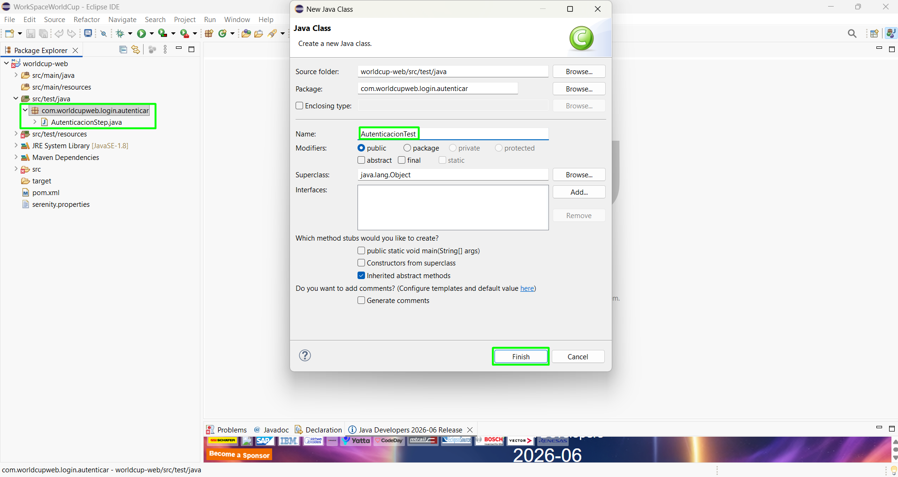
</p>
<p align="center">
  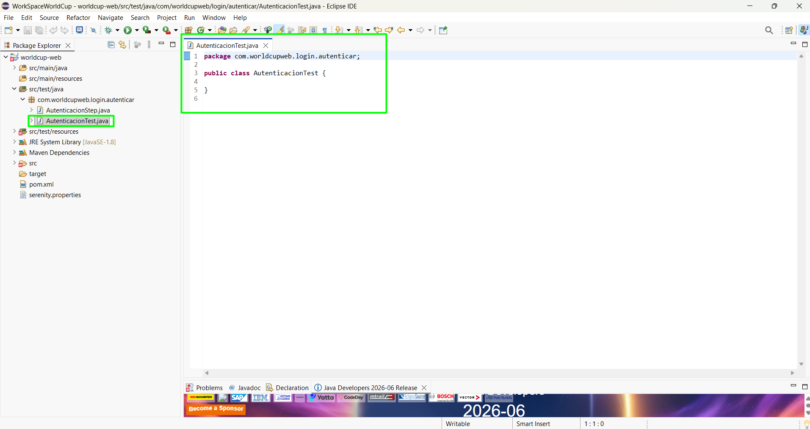
</p>

### Archivo AutenticacionTest.java completo
```java
package com.worldcupweb.login.autenticar;

import org.junit.platform.suite.api.ConfigurationParameter;
import org.junit.platform.suite.api.IncludeEngines;
import org.junit.platform.suite.api.SelectClasspathResource;
import org.junit.platform.suite.api.Suite;

import io.cucumber.core.options.Constants;

@Suite
@IncludeEngines("cucumber") //Indica quien va a tener el control de ja ejecución: Cucumber
@SelectClasspathResource("features/login") //Indica donde están ubicados los Features
@ConfigurationParameter(
		key = Constants.GLUE_PROPERTY_NAME,
		value = "com.worldcupweb.login.autenticar") //Indicamos en que paquete se deben buscar los Steps
@ConfigurationParameter(
		key = Constants.PLUGIN_PROPERTY_NAME,
		value = "io.cucumber.core.plugin.SerenityReporter,pretty") //Indicamos que cree el reporte con Serenity

public class AutenticacionTest {
	
}
```

## NOTA IMPORTANTE.

Antes de realiza la ejecución del proyecto, se deberán actualizar las propiedades, dependencias y builds que configuramos en el archivo pom.xml del proyecto.
Para realizar esa actualización, seleccionaremos click derecho en el proyecto, y seleccionamos la opción Maven - UpdateProject
<p align="center">
  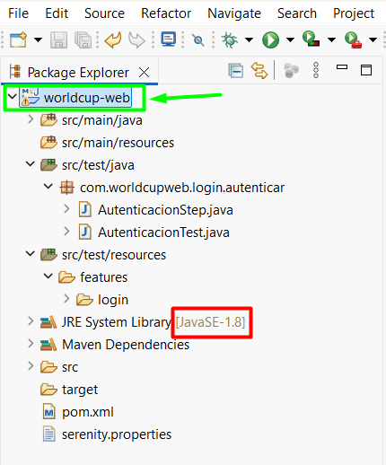
</p>
<p align="center">
  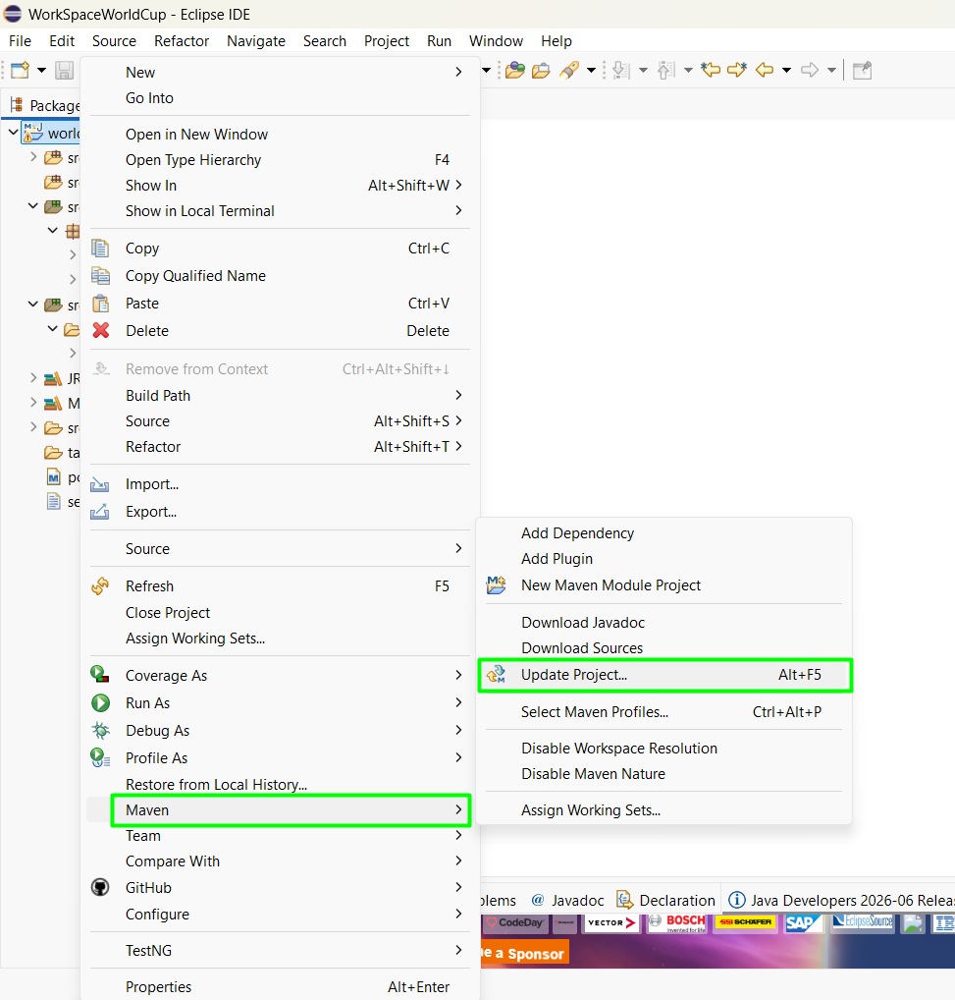
</p>

Luego seleccionamos la opción Force Update of Snapshots/Releases, seleccionamos el botón OK, y en nuestro proyecto se tendrá que visualizar la opción del Source y el Target que configuramos en el archivo pom.xml.
<p align="center">
  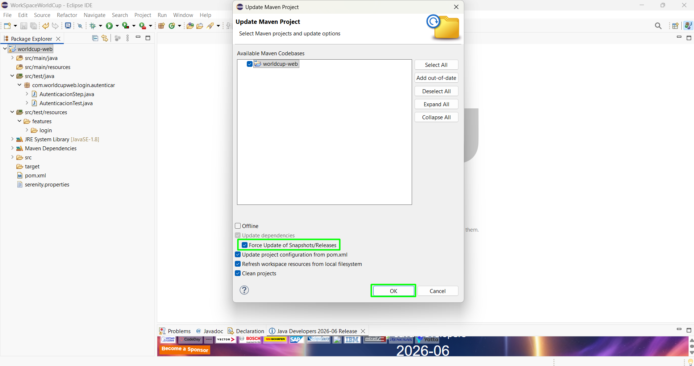
</p>
<p align="center">
  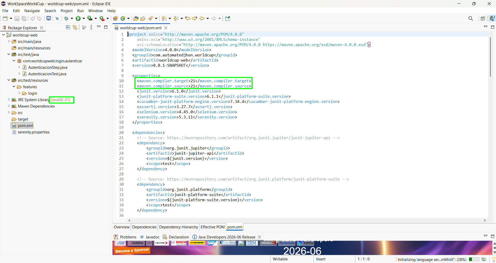
</p>
